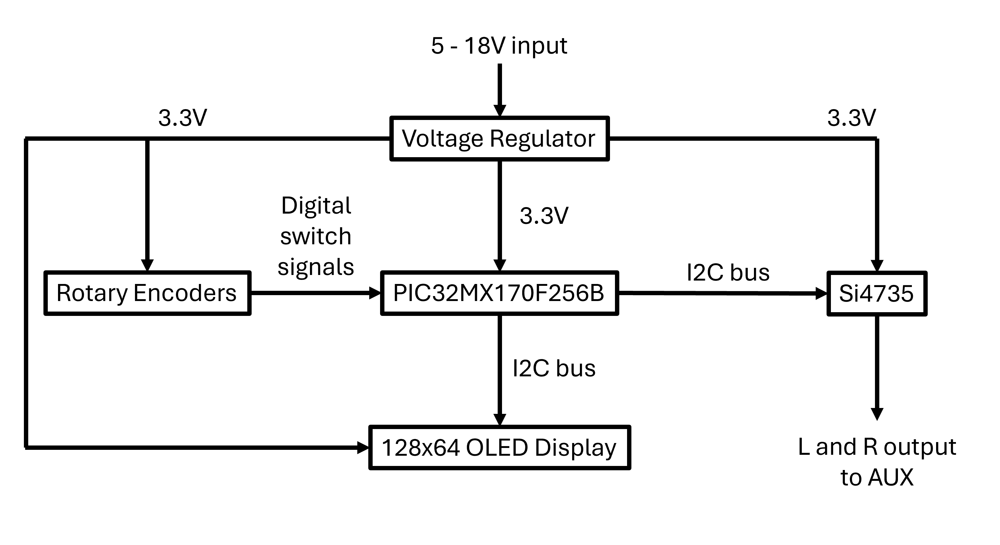
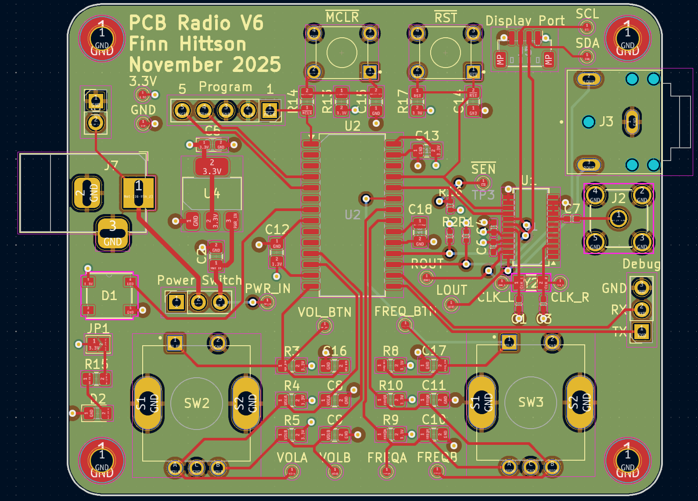
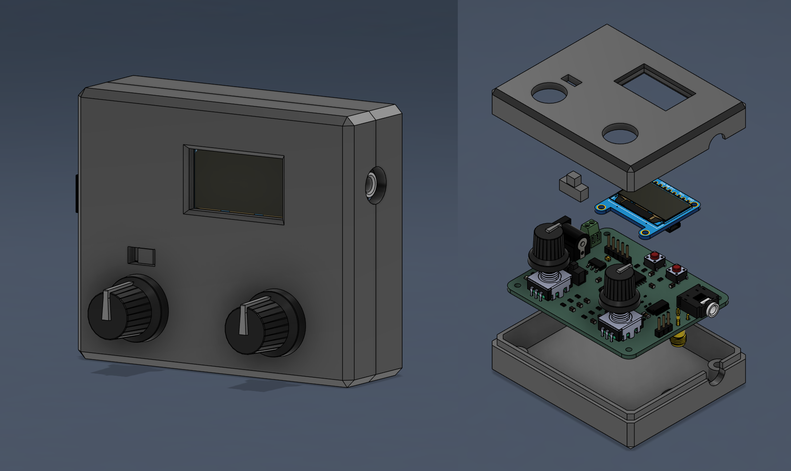

# PCB Radio

PCB Radio is an FM receiver operating from 88MHz to 108MHz. It uses the Si4735 radio IC and is controlled with PIC32. PCB radio initially started as my final project for a class called Board Level Design (EE256) offered at Stanford which I took during the 2023 fall quarter. I ended the class by turning in an ugly board with many jumper wires, solder blobs, and quickly written code. I decided to give the project an overhaul and the image below shows the final result. A video demo is avaliable [here](https://youtu.be/nEwSSWuvXEQ).

  

## Eletrical

At a high level there are four main components of PCB Radio, not including the voltage regulation. They are the microcontroller, the rotary encoders for user input, the radio, and the display. These blocks and their control methods are outlined in the following block diagram.

  

The voltage regulator is the [AMS1117-3.3](https://mm.digikey.com/Volume0/opasdata/d220001/medias/docus/7158/5272_AMS1117-3.3.pdf). This accepts and input voltage ranging from 5V to 18V. With the DC barrel jack input this lets PCB Radio be powered using a wide variety of DC barrel jack power supplies. The main components the voltage regulator powers are the microcontroller and the radio, while it also supplies the voltage logic level for the rotary encoders.  

  

The main brains of the operation is a [PIC32MX170F256B](https://ww1.microchip.com/downloads/en/DeviceDoc/PIC32MX1XX2XX%20283644-PIN_Datasheet_DS60001168L.pdf). This microcontroller was chosen for its ease in programming, my prior experience working specifically with Microchip's PIC32 microcontroller line, and its none "over-the-top" performance. The microcontroller recieves inputs from the rotary encoder using 3.3V logic level lines. These controls are interpreted in code and translated to command sent to the radio and display.

  

The radio itself is the [Si4735](https://www.skyworksinc.com/-/media/Skyworks/SL/documents/public/data-sheets/Si4730-31-34-35-D60.pdf) made by Skywork Solutions. This IC is responsible for all signal demodulation, filtering, and minor amplification. Its frequency range is 64–108 MHz and it is easily configurable through the I2C bus.  

  

Two rotary encoders control the volume and frequency selection. The buttons on the volume rotary encoder mute and unmute the audio. The button on the frequency rotary encoder seeks the next station in the direction of the last frequency change. There is no onboard amplifier or speaker so the audio is passed to an AUX output. Lastly there is a 128x64 OLED display made by Adafruit that is used to display volume and frequency selected.

The PCB was designed using KiCad and has the following schematic and layout. 

  

  

## Software

The code for this was written in C and programmed onto the PIC32 using the MPLABX IDE with the SNAP programmer. The rotary encoders operate on an interrupt basis to increment or decrement a counter. The updated value is passed to the Si4735 IC which correspondingly changes the volume or frequency. The frequency and volume buttons are periodically checked and the mute/seek commands are also sent along to the Si4735 IC.  
  
The dispaly is also controlled using the I2C bus. The display shows three lines being the title, volume, and frequency. Due to speed issues, only parts of the display are updated that need to changes while the remaining pixels remain unchanged. For example, when increasing the volume the only pixels that change are the pixels that compose the volume digits. The title, "vol: ", and frequency line all stay the same. The process for updating the frequency is the exact same. All characters are an 8x8 bitmapping.

## Case

The case was designed using Autodesk Fusion. It consists of three parts. The bottom case, top case, and button hat. The bottom case has heatset inserts to secure the pcb to the case frame. The top case has cutouts for the rotary encoders, display and power switch. The swtich had is needed to bridge the gap between the pcb and the height of the top case. 

  

